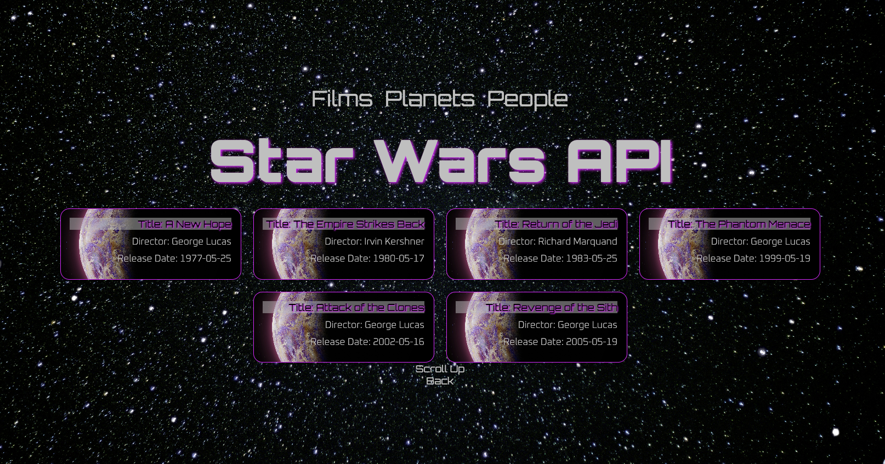

# ✨Star Wars API✨

## General info
This project utilizes the Star Wars API (SWAPI) and allows users to display information about films, planets, and people from the Star Wars universe.

## Technologies
This project is created with:
- HTML 
- CSS
- TypeScript

## Functions
- Display films: Clicking on the "Films" link displays a list of all Star Wars films.
- Display planets: Clicking on the "Planets" link displays a list of all planets in the Star Wars universe.
- Display people: Clicking on the "People" link displays a list of all people in the Star Wars universe.

## Learning Aspects
- Async functions: This project includes asynchronous functions to handle data processing from the API and to improve performance.
- Fetching API: The data is fetched from the Star Wars API (SWAPI) and displayed on the webpage.
- Quicktype: Used to generate TypeScript interfaces to define the structure of the API data and ensure type safety.

## Insight

